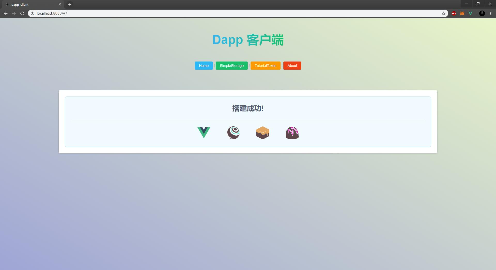
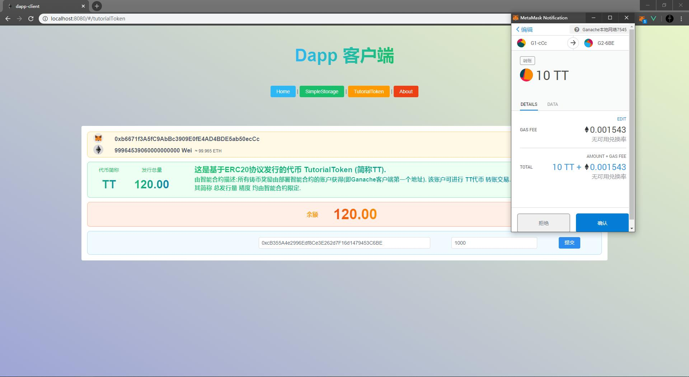

# dapp-client
- ETH Dapp 客户端 脚手架 (Truffle+Drizzle+Vue) 欢迎Star🎉

### 项目集成npm包
#### Core
1. vue: 2.6.11
2. vue-router: 3.1.6
3. vuex:3.3.0
4. @drizzle/vue-plugin: 0.1.1
#### UI
1. view-design: 4.1.3
#### Development
1. @vue/cli-service: 4.3.0
2. @vue/cli-plugin-router: 4.3.0
3. @vue/cli-plugin-vuex: 4.3.0
4. vue-template-compiler: 2.6.11

### 启动
#### 环境
- os: Windows 10 Pro 1903
- node: v12.16.1
- npm: 6.13.4
- @vue/cli: 4.2.3
- chrome plugins: MetaMask
#### 导入
1. 打开 vue控制台:
	> vue ui
2. 导入项目
3. 完成
#### IDE配置(WebStorm)
- (推荐) 在设置中 Webpack 添加WebStorm.config.js 路径. 使项目支持vue路径解析
- (可选) 配置 Scopes

### 备注
#### MetaMask
- 请确保 MetaMask 为最新版本并做好相关配置工作
- 若遇到转账交易失败,请注意 MetaMask 配置 或将 MetaMask 数据清除重置
#### Icon
- 图标采用 view-design库 和 Iconfont库. 
- view-design风格图标使用方式请查询官方文档
- Iconfont风格图标 使用 IconSvg.vue 组件引用
- 若添加图标 请前往 [Iconfont库官网](https://www.iconfont.cn/) 下载对应图标的二进制JS文件 
导入至 assets/iconfont 目录下

### 完成
- end